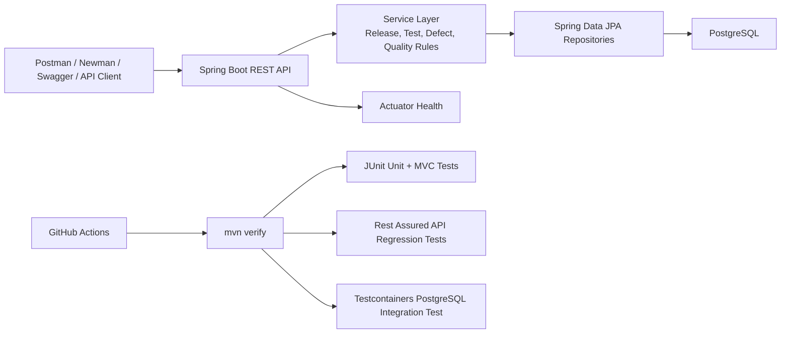

# Release Sentinel API

[](https://github.com/RafBro8/release-sentinel-api/actions/workflows/ci.yml)

Release Sentinel is a Spring Boot API for evaluating release readiness before software ships.
It combines release metadata, test execution results, defect severity, and quality gate rules into a clear release recommendation: `READY`, `AT_RISK`, or `BLOCKED`.

Live API: [https://release-sentinel-api.onrender.com/](https://release-sentinel-api.onrender.com/)

Swagger UI: [https://release-sentinel-api.onrender.com/swagger-ui/index.html](https://release-sentinel-api.onrender.com/swagger-ui/index.html)

## Why This Project Exists

Small engineering teams often make release decisions from scattered signals: spreadsheet test cases, defect tickets, Slack updates, CI logs, and manual QA notes.
Release Sentinel turns those signals into structured API data that can answer one practical question:

> Is this release ready to ship?

## What This Demonstrates

This project is designed as a backend/SDET portfolio case study.

- Java 21 and Spring Boot API development
- RESTful endpoint design around a realistic quality domain
- PostgreSQL persistence with Flyway migrations
- Dockerized local and production-style runtime
- JUnit 5 controller and service tests
- Rest Assured API regression tests
- PostgreSQL Testcontainers integration tests
- Postman collection and Newman CLI validation
- GitHub Actions CI running the Maven verification gate
- Render deployment with managed PostgreSQL
- Clear documentation for test strategy, deployment, and future improvements

## Core Workflow

Release Sentinel models a realistic QA/release flow:

1. Create a project.
2. Create target environments.
3. Create a release.
4. Add test cases.
5. Start a test run for the release.
6. Record test executions.
7. Link defects to the release.
8. Request a quality summary.
9. Receive a release recommendation.

Example quality summary endpoint:

```http
GET /api/releases/{releaseId}/quality-summary
```

The quality gate considers failed executions, open critical defects, unresolved high-severity defects, and overall release signals before returning the recommendation.

## API Highlights

| Area | Example Endpoints |
| --- | --- |
| System | `GET /`, `GET /api/status`, `GET /actuator/health` |
| Projects | `POST /api/projects`, `GET /api/projects` |
| Environments | `POST /api/projects/{projectId}/environments` |
| Releases | `POST /api/projects/{projectId}/releases`, `GET /api/releases/{releaseId}` |
| Test cases | `POST /api/projects/{projectId}/test-cases` |
| Test runs | `POST /api/releases/{releaseId}/test-runs` |
| Test executions | `POST /api/test-runs/{testRunId}/executions` |
| Defects | `POST /api/releases/{releaseId}/defects`, `PATCH /api/defects/{defectId}/status` |
| Quality gates | `GET /api/releases/{releaseId}/quality-summary` |

## Architecture



More detail: [Architecture and Deployment](docs/architecture-and-deployment.md)

## Test Strategy

The project uses layered testing so the same behavior is checked at different levels of confidence and cost.

| Layer | Tools | Purpose |
| --- | --- | --- |
| Unit/service tests | JUnit 5, Mockito | Validate business rules and status transitions quickly |
| Controller tests | Spring MVC test, MockMvc | Validate HTTP contracts, validation, and response shape |
| API regression tests | Rest Assured | Exercise end-to-end release readiness workflows against the API |
| Integration tests | Testcontainers, PostgreSQL | Verify persistence, Flyway migrations, and API behavior against a real database |
| Manual/CLI validation | Postman, Newman | Provide a shareable API workflow for demos and smoke checks |
| CI quality gate | GitHub Actions, Maven | Run automated verification on push and pull request |

More detail: [Testing Strategy](docs/testing-strategy.md)

## Local Development

Prerequisites:

- Java 21
- Maven 3.9+
- Docker

Start PostgreSQL:

```bash
docker compose up -d
```

Run the API:

```bash
mvn spring-boot:run
```

Useful local URLs:

- API info: `http://localhost:8080/`
- Status: `http://localhost:8080/api/status`
- Health: `http://localhost:8080/actuator/health`
- Swagger UI: `http://localhost:8080/swagger-ui/index.html`

## Verification Commands

Run the fast test suite:

```bash
mvn test
```

Run the full Maven verification gate, including PostgreSQL-backed integration tests:

```bash
mvn verify
```

Run the Postman/Newman workflow locally:

```bash
npx newman run postman/release-sentinel-api.postman_collection.json \
  -e postman/release-sentinel-local.postman_environment.json
```

Run the same workflow against the deployed Render API:

```bash
npx newman run postman/release-sentinel-api.postman_collection.json \
  -e postman/release-sentinel-local.postman_environment.json \
  --env-var baseUrl=https://release-sentinel-api.onrender.com
```

Build the production-style Docker image:

```bash
docker build -t release-sentinel-api .
```

## Production Deployment

The API is deployed to Render using the repository `Dockerfile` and a Render PostgreSQL database.

Runtime environment variables:

| Variable | Purpose |
| --- | --- |
| `SPRING_PROFILES_ACTIVE` | Uses the `prod` Spring profile |
| `SPRING_DATASOURCE_URL` | JDBC URL for PostgreSQL |
| `SPRING_DATASOURCE_USERNAME` | PostgreSQL username |
| `SPRING_DATASOURCE_PASSWORD` | PostgreSQL password |
| `PORT` | Render-provided HTTP port |
| `JAVA_OPTS` | Optional JVM tuning |

Render health check path:

```text
/actuator/health
```

## CI/CD

GitHub Actions runs this command on pushes and pull requests to `master`:

```bash
mvn --batch-mode --no-transfer-progress verify
```

If the workflow fails, Maven Surefire and Failsafe reports are uploaded as artifacts for debugging.

## Current Status

Backend development is complete for the portfolio API milestone.

Completed:

- Release tracking APIs
- Test case, test run, and test execution APIs
- Defect tracking APIs
- Quality gate summary API
- PostgreSQL persistence and Flyway migrations
- JUnit, Rest Assured, Testcontainers, Postman/Newman, and CI validation
- Docker packaging and Render deployment
- Public root endpoint for portfolio visitors

Potential future enhancements:

- Small React dashboard hosted on Vercel
- Authentication and role-based access
- Configurable quality gate thresholds
- GitHub/Jira integration for importing defects and CI results
- Production smoke-test workflow against the Render URL

## Project Stages

| Stage | Focus | Outcome |
| --- | --- | --- |
| 1 | Project foundation | Runnable Spring Boot API skeleton |
| 2 | Projects, environments, releases | Core release tracking model |
| 3 | Test cases and test runs | Test execution data model |
| 4 | Defects | Severity, status, and release-blocking rules |
| 5 | Quality gate engine | READY, AT_RISK, or BLOCKED release recommendation |
| 6 | Rest Assured suite | Automated API regression tests |
| 7 | Testcontainers | Real PostgreSQL integration tests |
| 8 | Postman/Newman | Manual and CLI API validation |
| 9 | CI/CD | Automated build and quality pipeline |
| 10 | Production deployment prep | Docker image, production config, and deploy docs |
| 11 | Render deployment | Public API deployment with managed PostgreSQL |
| 12 | Portfolio polish | README, architecture notes, and test strategy documentation |
