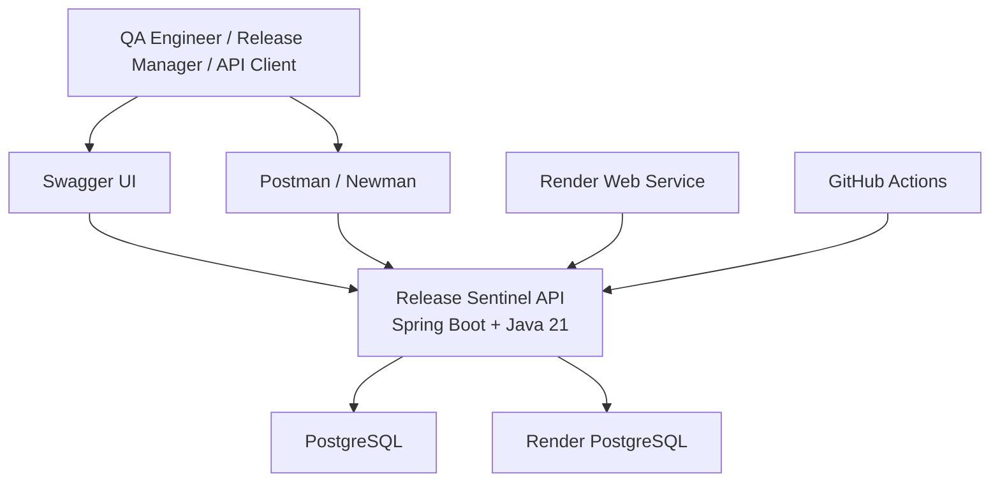
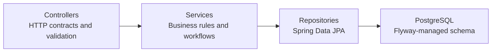
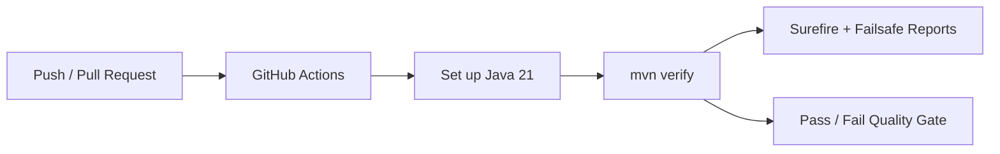

# Architecture and Deployment

Release Sentinel is a layered Spring Boot backend API deployed as a Dockerized service.

## System Context



## Backend Layers



## Domain Areas

| Area | Responsibility |
| --- | --- |
| Projects | Product/application boundary for release tracking |
| Environments | Deployment or testing targets such as QA, staging, or production |
| Releases | Candidate version under evaluation |
| Test cases | Planned quality coverage |
| Test runs | Execution session for a release |
| Test executions | Result of a test case inside a run |
| Defects | Release-linked quality risks |
| Quality gate | Recommendation engine for `READY`, `AT_RISK`, or `BLOCKED` |

## Data and Migration Strategy

Flyway owns schema creation and migration:

- `V1__create_release_tracking_tables.sql`
- `V2__create_test_execution_tables.sql`
- `V3__create_defects_table.sql`

The application runs with:

```yaml
spring:
  jpa:
    hibernate:
      ddl-auto: validate
```

That means Hibernate validates mappings against the schema, while Flyway remains the source of truth for database structure.

## Local Runtime

Local development uses Docker Compose for PostgreSQL:

```bash
docker compose up -d
mvn spring-boot:run
```

Local URLs:

- `http://localhost:8080/`
- `http://localhost:8080/api/status`
- `http://localhost:8080/actuator/health`
- `http://localhost:8080/swagger-ui/index.html`

## Docker Runtime

The repository includes a multi-stage Dockerfile:

1. Build stage uses Maven and Java 21.
2. Runtime stage uses a smaller Java 21 JRE image.
3. The app starts with the `prod` profile by default.
4. The container binds to the platform-provided `PORT`.

Build locally:

```bash
docker build -t release-sentinel-api .
```

## Render Deployment

The production deployment uses:

- Render Web Service
- Repository Dockerfile
- Render PostgreSQL
- `prod` Spring profile
- `/actuator/health` health check

Runtime environment variables:

| Variable | Purpose |
| --- | --- |
| `SPRING_PROFILES_ACTIVE` | Set to `prod` |
| `SPRING_DATASOURCE_URL` | PostgreSQL JDBC URL |
| `SPRING_DATASOURCE_USERNAME` | Database username |
| `SPRING_DATASOURCE_PASSWORD` | Database password |
| `PORT` | Render-provided port |
| `JAVA_OPTS` | Optional JVM flags |

Important datasource format:

```text
jdbc:postgresql://host:5432/database
```

The username and password should be stored separately in `SPRING_DATASOURCE_USERNAME` and `SPRING_DATASOURCE_PASSWORD`.

## CI/CD

GitHub Actions runs the Maven verification gate on pushes and pull requests to `master`.



## Operational Notes

- Render may take a few moments to replace an old instance after deployment completes.
- Manual deploy may be needed if automatic deploy is disabled or Render does not pick up the latest commit.
- Clear build cache can be useful when a Docker layer cache appears stale.
- The API root endpoint exists so portfolio visitors get useful JSON instead of a generic 404 page.

## Future Architecture Options

- React dashboard hosted on Vercel.
- Authentication and role-based access control.
- Configurable quality gate thresholds per project.
- External imports from CI systems, GitHub, Jira, or Linear.
- Scheduled production smoke tests.
